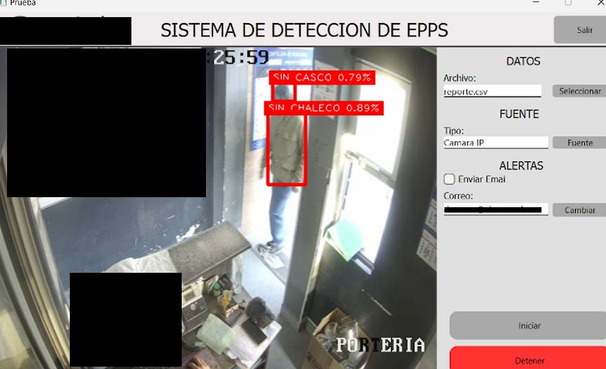

# Detector de Equipos de Protección Personal (EPP)

Este proyecto es una aplicación de escritorio que detecta automáticamente el uso de Equipos de Protección Personal en tiempo real utilizando **YOLOv8** y **aceleración por CUDA**.  
Además, envía **notificaciones por correo electrónico** a los supervisores cuando se detecta una falta de EPP.

## Características
- Detección rápida de EPPs (cascos, chalecos) en tiempo real.
- Aceleración de inferencia usando **GPU con CUDA**.
- Interfaz gráfica amigable construida con **PyQt5**.
- Envío automático de alertas por **correo electrónico** ante faltas de seguridad.

## Tecnologías
- Python
- YOLOv8
- PyQt5
- OpenCV
- CUDA
- SMTP (correo)
